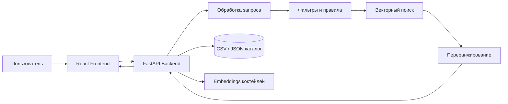

# BarBuddy

> Умный сервис подбора коктейлей по текстовому описанию вкуса, ингредиентам и личным ограничениям.

BarBuddy помогает выбрать коктейль, когда пользователь не знает точное название напитка, но понимает, чего хочет: сладкий и цитрусовый вкус, низкую крепость, определённый алкоголь или рецепт из ингредиентов, которые уже есть дома.

Проект принимает запрос на естественном языке, анализирует предпочтения пользователя и возвращает **топ-3 наиболее подходящих коктейля**.

## Возможности

- Поиск коктейлей по свободному текстовому запросу на русском языке
- Подбор по желаемому вкусу, крепости, алкоголю и ингредиентам
- Поиск по ингредиентам, которые есть дома
- Выдача топ-3 рекомендаций
- Каталог коктейлей с фильтрами
- Подробные карточки рецептов
- Уточнение предыдущего запроса: «сделай слаще», «менее крепкий», «без джина»
- Разделение официальных IBA-коктейлей по категориям
- Отдельная вкладка с ограничениями: аллергии, исключённые ингредиенты, отсутствие алкоголя, максимальная крепость
- Возможность расширения до аккаунтов, избранного и истории запросов

## Примеры запросов

```text
Хочу сладкий, терпкий и цитрусовый коктейль

Подбери слабоалкогольный ягодный коктейль с использованием джина

Хочу коктейль с егермейстером

У меня дома есть ром, лайм, мята и сахар

Хочу что-то освежающее, но без текилы

Сделай предыдущий вариант менее крепким
```

## Как это работает

1. Пользователь вводит описание желаемого коктейля или список доступных ингредиентов.
2. Сервис извлекает из запроса предпочтения: вкусовые характеристики, крепость, алкогольную основу, ингредиенты и ограничения.
3. Сначала применяется фильтрация по жёстким условиям: исключённым ингредиентам, аллергиям, наличию алкоголя и максимальной крепости.
4. Затем система сравнивает смысл запроса с текстовыми описаниями коктейлей через векторные представления.
5. Результаты дополнительно переранжируются с учётом совпадения вкуса, крепости, ингредиентов и сложности приготовления.
6. Пользователь получает три наиболее подходящих коктейля с полной информацией о каждом рецепте.

## Рекомендательная система

BarBuddy использует гибридный подход:

- **Правила и фильтры** — исключают неподходящие варианты, например коктейли с аллергическими ингредиентами или слишком высокой крепостью
- **Семантический поиск** — сопоставляет текст пользователя с описаниями вкуса и ингредиентов коктейлей
- **Векторное сходство** — определяет близость запроса и коктейльного профиля
- **Переранжирование** — повышает релевантность результатов с учётом приоритетов пользователя

Приоритет признаков в MVP:

1. Вкус
2. Ограничения и исключённые ингредиенты
3. Тип алкоголя
4. Крепость
5. Наличие ингредиентов дома
6. Сложность и время приготовления

### Логика оценки

Для каждого кандидата рассчитывается итоговый score:

```text
score =
    w_taste * semantic_similarity
    + w_ingredients * ingredient_match
    + w_strength * strength_match
    + w_alcohol * alcohol_base_match
    + w_availability * available_ingredients_match
```

Коктейли, не соответствующие обязательным ограничениям пользователя, исключаются до расчёта итогового рейтинга.

## Данные

В первой версии проекта данные будут храниться локально в форматах CSV и JSON.

### Основные источники

- Официальный каталог International Bartenders Association (IBA)
- TheCocktailDB API как дополнительный источник рецептов, изображений и метаданных
- Ручная валидация рецептов перед добавлением в основной каталог

IBA-коктейли будут разделены на категории:

- `The Unforgettables`
- `Contemporary Classics`
- `New Era Drinks`

Для каждого напитка предполагается хранить:

```json
{
  "id": "negroni",
  "name": "Negroni",
  "category": "The Unforgettables",
  "image_url": "https://example.com/negroni.jpg",
  "ingredients": [
    {
      "name": "Gin",
      "amount": "30 ml"
    },
    {
      "name": "Campari",
      "amount": "30 ml"
    },
    {
      "name": "Sweet Vermouth",
      "amount": "30 ml"
    }
  ],
  "instructions": "Смешать ингредиенты в стакане со льдом.",
  "glass": "Old Fashioned glass",
  "strength": "strong",
  "abv_estimate": 24,
  "preparation_time_minutes": 3,
  "taste_tags": [
    "горький",
    "цитрусовый",
    "травяной",
    "крепкий"
  ],
  "taste_description": "Крепкий горько-сладкий коктейль с травяными и цитрусовыми нотами.",
  "source": "IBA"
}
```

> Вкусовые теги и текстовые описания будут создаваться с помощью LLM, после чего проходить ручную проверку. Оригинальные рецептуры, граммовки и способы приготовления не должны изменяться.

## Функции MVP

### Главная страница

- Поле ввода текстового запроса
- Быстрые примеры запросов
- Кнопка запуска поиска
- Блок с топ-3 рекомендациями
- Возможность уточнить предыдущий запрос

### Результаты поиска

Каждая рекомендация содержит:

- Фото коктейля
- Название
- Категорию
- Вкусовой профиль
- Примерную крепость
- Список ингредиентов
- Полные граммовки
- Способ приготовления
- Тип бокала
- Время приготовления
- Источник рецепта

### Каталог

- Общий список коктейлей
- Разделение по категориям IBA
- Поиск по названию
- Фильтрация по:
  - алкогольной основе
  - вкусу
  - ингредиентам
  - крепости
  - категории
  - времени приготовления
  - наличию алкоголя

### Ограничения

Отдельная вкладка позволяет настроить:

- Ингредиенты, которые пользователь не употребляет
- Возможные аллергены
- Предпочтение безалкогольных напитков
- Максимальный допустимый уровень крепости
- Ингредиенты, которые доступны дома

## Будущие функции

- Регистрация и авторизация
- Личный профиль вкусов
- Избранные коктейли
- История запросов и рекомендаций
- Оценка рекомендаций пользователем
- Обучение на лайках и дизлайках
- Генерация вариаций рецепта
- Режим «бармен»: настройка сладости, кислоты и крепости напитка
- Поддержка английского языка
- Мобильное приложение
- Публичный деплой и API

## Технологический стек

| Часть системы | Технологии |
|---|---|
| Frontend | React, TypeScript, Vite |
| Стили | CSS Modules или Tailwind CSS |
| Backend | Python, FastAPI |
| Векторизация текста | sentence-transformers |
| Поиск похожих коктейлей | NumPy / scikit-learn, позднее FAISS |
| Обработка данных | Pandas |
| Формат данных MVP | CSV, JSON |
| Тестирование | Pytest, Vitest |
| Контроль версий | Git, GitHub |
| Контейнеризация | Docker, после MVP |

## Архитектура



## Структура проекта

```text
drink-dna/
├── backend/
│   ├── app/
│   │   ├── api/
│   │   │   ├── routes_search.py
│   │   │   ├── routes_cocktails.py
│   │   │   └── routes_constraints.py
│   │   ├── core/
│   │   │   └── config.py
│   │   ├── services/
│   │   │   ├── recommender.py
│   │   │   ├── query_parser.py
│   │   │   ├── ranker.py
│   │   │   └── data_loader.py
│   │   ├── schemas/
│   │   │   ├── cocktail.py
│   │   │   └── search.py
│   │   └── main.py
│   ├── data/
│   │   ├── cocktails.csv
│   │   ├── cocktails.json
│   │   └── embeddings.npy
│   ├── notebooks/
│   │   └── data_research.ipynb
│   ├── tests/
│   │   └── test_recommender.py
│   └── requirements.txt
│
├── frontend/
│   ├── src/
│   │   ├── components/
│   │   │   ├── SearchForm/
│   │   │   ├── CocktailCard/
│   │   │   ├── CocktailFilters/
│   │   │   └── ConstraintsForm/
│   │   ├── pages/
│   │   │   ├── HomePage/
│   │   │   ├── CatalogPage/
│   │   │   ├── CocktailPage/
│   │   │   └── ConstraintsPage/
│   │   ├── api/
│   │   ├── types/
│   │   └── App.tsx
│   ├── package.json
│   └── vite.config.ts
│
├── docs/
│   ├── architecture.md
│   └── screenshots/
│
├── LICENSE
└── README.md
```

## API

### `POST /api/search`

Принимает текстовый запрос и пользовательские ограничения.

```json
{
  "query": "Хочу сладкий, терпкий и цитрусовый коктейль",
  "available_ingredients": [
    "gin",
    "lime",
    "sugar syrup"
  ],
  "excluded_ingredients": [
    "tequila"
  ],
  "max_abv": 20,
  "top_k": 3
}
```

Пример ответа:

```json
{
  "query": "Хочу сладкий, терпкий и цитрусовый коктейль",
  "results": [
    {
      "id": "example-cocktail",
      "name": "Example Cocktail",
      "score": 0.91,
      "taste_tags": [
        "сладкий",
        "цитрусовый",
        "терпкий"
      ],
      "strength": "medium"
    }
  ]
}
```

### `GET /api/cocktails`

Возвращает каталог коктейлей с фильтрацией.

Пример параметров:

```text
/api/cocktails?category=New%20Era%20Drinks&taste=цитрусовый&base_alcohol=gin
```

### `GET /api/cocktails/{id}`

Возвращает полную информацию о конкретном коктейле.

## Локальный запуск

### Требования

- Python 3.11+
- Node.js 20+
- npm или pnpm
- Git

### Backend

```bash
git clone https://github.com/your-username/drink-dna.git
cd drink-dna/backend

python -m venv .venv
```

Для macOS/Linux:

```bash
source .venv/bin/activate
```

Для Windows:

```bash
.venv\Scripts\activate
```

Установка зависимостей:

```bash
pip install -r requirements.txt
```

Запуск сервера:

```bash
uvicorn app.main:app --reload
```

Backend будет доступен по адресу:

```text
http://127.0.0.1:8000
```

Документация FastAPI:

```text
http://127.0.0.1:8000/docs
```

### Frontend

В отдельном терминале:

```bash
cd drink-dna/frontend
npm install
npm run dev
```

Frontend будет доступен по адресу:

```text
http://localhost:5173
```

## План разработки

### Этап 1 — Данные

- Собрать базовый каталог IBA-коктейлей
- Добавить рецепты, ингредиенты, граммовки и инструкции
- Сформировать вкусовые теги и текстовые описания
- Провести ручную проверку данных
- Подготовить CSV и JSON

### Этап 2 — Рекомендательная логика

- Реализовать фильтрацию по ингредиентам и ограничениям
- Создать baseline на совпадении тегов
- Добавить семантическую векторизацию описаний
- Реализовать cosine similarity
- Добавить переранжирование результатов
- Подготовить тестовые пользовательские запросы

### Этап 3 — Backend

- Создать FastAPI-приложение
- Реализовать API поиска
- Реализовать API каталога
- Добавить валидацию данных через Pydantic
- Написать тесты ключевой логики

### Этап 4 — Frontend

- Создать React-интерфейс
- Реализовать главную страницу поиска
- Добавить карточки коктейлей
- Реализовать каталог и фильтры
- Добавить страницу ограничений
- Сделать адаптивную вёрстку

### Этап 5 — Оформление

- Добавить скриншоты интерфейса
- Подготовить схему архитектуры
- Настроить линтеры и форматирование
- Написать документацию
- Подготовить публичное демо

## Критерии качества

Для проверки работы рекомендации будет подготовлен набор тестовых запросов с ручной разметкой ожидаемых результатов.

Основные метрики:

- `Precision@3` — доля релевантных коктейлей среди первых трёх результатов
- `Recall@3` — доля найденных релевантных коктейлей
- `MRR` — позиция первого релевантного результата
- Доля запросов, для которых соблюдены обязательные ограничения
- Ручная оценка релевантности рекомендаций

## Ограничения

- Рекомендации не являются медицинской консультацией.
- Пользователь должен самостоятельно проверять наличие аллергенов в ингредиентах.
- Данные о крепости напитков могут быть приблизительными.
- Сервис не пропагандирует употребление алкоголя.
- Контент предназначен только для совершеннолетних пользователей.
- Рецепты, изображения и описания должны использоваться с соблюдением прав источников.

## Скриншоты

Скриншоты будут добавлены после реализации MVP.

```text
docs/screenshots/home.png
docs/screenshots/catalog.png
docs/screenshots/cocktail-page.png
docs/screenshots/constraints.png
```

## Roadmap

- [ ] Подготовить датасет коктейлей
- [ ] Сформировать вкусовые описания и теги
- [ ] Создать baseline-рекомендатор
- [ ] Добавить embeddings и семантический поиск
- [ ] Реализовать FastAPI backend
- [ ] Создать React frontend
- [ ] Добавить каталог и фильтры
- [ ] Реализовать ограничения пользователя
- [ ] Написать тесты
- [ ] Добавить Docker
- [ ] Развернуть публичную версию
- [ ] Добавить аккаунты, избранное и историю запросов

## Лицензия

Проект распространяется под лицензией MIT. Подробнее см. в файле [LICENSE](./LICENSE).

## Автор

Алексей Образцов

AI Engineering student at ITMO University

GitHub: `https://github.com/your-username`
